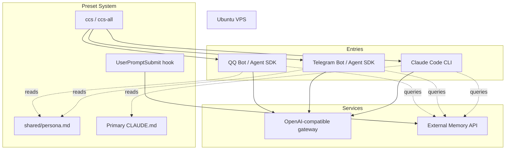

# ClaudeCode Preset System

[简体中文](./README.md) | English

A multi-entry, multi-model preset system for Claude Code CLI and Agent SDK based bots.

It lets one VPS run multiple AI entry points while sharing a central persona file and switching model presets without changing application code.

## What this solves

In a multi-entry AI assistant setup, the same assistant may be accessed through Claude Code CLI, Telegram, QQ, or other Agent SDK based services. These entries often need consistent persona files, model configuration, gateway settings, and optional memory integration.

Without a preset system, switching models usually means editing several scattered files by hand:

- CLI environment variables
- Bot environment files
- systemd drop-in configuration
- model IDs
- gateway configuration
- persona/system prompt files

This repository turns those scattered configuration edits into repeatable preset switches.

- Run multiple entries on one VPS: Claude Code CLI, Telegram bot, QQ bot, or other Agent SDK based services.
- Switch model providers with one command.
- Keep persona/system prompt synchronized across entries.
- Allow one primary Claude Code profile to keep an independent persona file if desired.
- Optionally connect your own external memory service at the application layer.

## Architecture



## Persona file layout

| Entry | Persona source | Notes |
|---|---|---|
| Primary Claude Code CLI | independent `CLAUDE.md` | Can evolve separately |
| Bot entries | symlink to `shared/persona.md` | Shared persona |
| Non-primary CLI presets | symlink to `shared/persona.md` | Shared persona |

The shared persona file is the single source of truth:

```text
shared/persona.md
```

Model preset directories link to it:

```text
cli-presets/<model>/CLAUDE.md -> ../../shared/persona.md
```

## Directory layout

```text
claude-presets/
├── shared/
│   ├── persona.md
├── cli-presets/
│   ├── opus/
│   │   ├── .env.example
│   │   ├── settings.json
│   │   └── CLAUDE.md -> ../../shared/persona.md
│   ├── kimi/
│   ├── glm/
│   └── minimax/
└── bot-presets/
    ├── opus.env.example
    ├── kimi.env.example
    ├── glm.env.example
    └── minimax.env.example
```

## Model presets

Use your own gateway/model IDs. Example:

| Preset | Model ID | Provider |
|---|---|---|
| opus | `your-opus-model-id` | OpenAI-compatible gateway |
| kimi | `your-kimi-model-id` | OpenAI-compatible gateway |
| glm | `your-glm-model-id` | OpenAI-compatible gateway |
| minimax | `your-minimax-model-id` | OpenAI-compatible gateway |

## Daily usage

```bash
# Switch Claude Code CLI preset only
ccs opus
ccs kimi

# Switch bot services together
sudo ccs-all opus
sudo ccs-all kimi
```

CLI and bot entries can run different presets at the same time.

## Add a new model preset

```bash
MODEL=new-model
mkdir -p "cli-presets/$MODEL"
ln -sf ../../shared/persona.md "cli-presets/$MODEL/CLAUDE.md"
cp cli-presets/kimi/settings.json "cli-presets/$MODEL/settings.json"
cp cli-presets/kimi/.env.example "cli-presets/$MODEL/.env.example"
cp bot-presets/kimi.env.example "bot-presets/$MODEL.env.example"
```

Then fill in the real values locally. Never commit real `.env` files.

## External memory integration

This preset layout can work with external memory, but this repository does not include any specific memory-service implementation.

Important rule:

Do not put the hook in the global Claude Code settings if Agent SDK bots also read that settings file. In non-interactive SDK environments, global hooks may hang the bot and produce empty responses.

Recommended:

- If you add hooks yourself, put them only in preset-specific `settings.json` files used by Claude Code CLI.
- Let bot code inject external memory explicitly at the application layer.

## systemd switching

Bot services can be switched by writing a systemd drop-in file:

```text
/etc/systemd/system/<bot-service>.service.d/preset.conf
```

Example content:

```ini
[Service]
EnvironmentFile=
EnvironmentFile=/path/to/claude-presets/bot-presets/kimi.env
```

The empty `EnvironmentFile=` line clears previously configured environment files before applying the selected preset.

Then reload, restart, and check status:

```bash
sudo systemctl daemon-reload
sudo systemctl restart <bot-service>
systemctl is-active <bot-service>
```

## Pitfalls

| Pitfall | Symptom | Fix |
|---|---|---|
| Global settings hook | Agent SDK bot hangs or returns empty output | Put hook only in preset settings |
| `env` block in global settings | Model switching seems ineffective | Keep model env in preset `.env` files |
| `export` in systemd env file | systemd ignores variables | Use plain `KEY=VALUE` |
| Missing `EnvironmentFile=` reset | Old systemd env files may stay active | Clear existing entries before writing the selected preset |
| Multiple persona copies | Presets drift over time | Use symlinks to one shared persona |

## AI-assisted build note

This project was organized with help from Claude Code. Claude Code was used for requirement breakdown, shell script drafting, systemd behavior debugging, preset layout design, and public-release documentation cleanup.

## Roadmap

- Add application-layer memory injection examples without depending on one specific memory service.
- Add periodic conversation summary hooks or examples.
- Improve context caching for bot entries.
- Add optional vector retrieval or RAG examples.
- Support layered persona files, such as a shared base persona plus model-specific overrides.

## Security

This repository is a template. Do not commit:

- API keys or auth tokens
- real `.env` files
- private persona files
- chat logs or memory exports
- Claude Code runtime directories such as sessions, cache, history, projects, backups
- SSH keys or VPS-specific secrets
