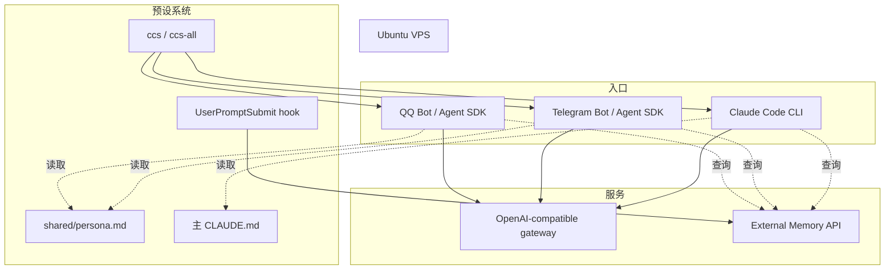

# ClaudeCode Preset System

简体中文 | [English](./README.en.md)

一个用于 Claude Code CLI 和 Agent SDK 机器人服务的多入口、多模型预设切换系统。

它可以让一台 VPS 同时运行多个 AI 入口，并通过共享人格文件和模型预设，在不修改应用代码的情况下切换模型配置。

## 解决的问题

在多入口 AI 助手系统中，同一个助手可能同时通过 Claude Code CLI、Telegram、QQ 或其他 Agent SDK 服务访问。这些入口通常需要保持一致的人格文件、模型配置、网关配置，以及可选的外部记忆接入。

如果没有预设系统，切换模型时通常要手动修改多个分散的位置：

- CLI 环境变量
- Bot 环境变量文件
- systemd drop-in 配置
- 模型 ID
- 网关配置
- persona / system prompt 文件

这个仓库把这些分散配置收敛成可重复执行的 preset 切换流程。

主要能力：

- 在一台 VPS 上运行多个入口：Claude Code CLI、Telegram bot、QQ bot 或其他 Agent SDK 服务。
- 用一个命令切换模型提供方。
- 让多个入口共享同一个 persona / system prompt。
- 允许一个主 Claude Code 配置保留独立人格文件。
- 可在应用层接入自己的外部记忆服务。

## 架构



## Persona 文件布局

| 入口 | Persona 来源 | 说明 |
|---|---|---|
| 主 Claude Code CLI | 独立 `CLAUDE.md` | 可以单独演化 |
| Bot 入口 | 软链到 `shared/persona.md` | 共享 persona |
| 非主 CLI preset | 软链到 `shared/persona.md` | 共享 persona |

共享 persona 文件是单一事实来源：

```text
shared/persona.md
```

各模型 preset 目录通过相对软链指向它：

```text
cli-presets/<model>/CLAUDE.md -> ../../shared/persona.md
```

## 目录结构

```text
claude-presets/
├── shared/
│   ├── persona.md
├── cli-presets/
│   ├── opus/
│   │   ├── .env.example
│   │   ├── settings.json
│   │   └── CLAUDE.md -> ../../shared/persona.md
│   ├── kimi/
│   ├── glm/
│   └── minimax/
└── bot-presets/
    ├── opus.env.example
    ├── kimi.env.example
    ├── glm.env.example
    └── minimax.env.example
```

## 模型预设

请替换成你自己的网关地址和模型 ID。示例：

| Preset | Model ID | Provider |
|---|---|---|
| opus | `your-opus-model-id` | OpenAI-compatible gateway |
| kimi | `your-kimi-model-id` | OpenAI-compatible gateway |
| glm | `your-glm-model-id` | OpenAI-compatible gateway |
| minimax | `your-minimax-model-id` | OpenAI-compatible gateway |

## 日常使用

```bash
# 只切换 Claude Code CLI preset
ccs opus
ccs kimi

# 同步切换 bot 服务 preset
sudo ccs-all opus
sudo ccs-all kimi
```

CLI 和 bot 入口可以同时运行不同 preset。

## 新增模型 preset

```bash
MODEL=new-model
mkdir -p "cli-presets/$MODEL"
ln -sf ../../shared/persona.md "cli-presets/$MODEL/CLAUDE.md"
cp cli-presets/kimi/settings.json "cli-presets/$MODEL/settings.json"
cp cli-presets/kimi/.env.example "cli-presets/$MODEL/.env.example"
cp bot-presets/kimi.env.example "bot-presets/$MODEL.env.example"
```

然后在本地填写真实配置。不要提交真实 `.env` 文件。

## 外部记忆接入

这个 preset 布局可以配合外部记忆服务使用，但本仓库不包含任何具体记忆服务的实现。

重要规则：

如果 Agent SDK bot 也会读取全局 Claude Code settings，不要把 hook 放在全局 settings 里。在非交互式 SDK 环境中，全局 hook 可能导致 bot 卡住或返回空输出。

推荐做法：

- 如果你需要 hook，把它放在 Claude Code CLI 使用的 preset-specific `settings.json` 里。
- Bot 侧由应用层显式注入外部记忆。

## systemd 切换

Bot 服务可以通过写入 systemd drop-in 文件切换 preset：

```text
/etc/systemd/system/<bot-service>.service.d/preset.conf
```

示例内容：

```ini
[Service]
EnvironmentFile=
EnvironmentFile=/path/to/claude-presets/bot-presets/kimi.env
```

空的 `EnvironmentFile=` 用于清除旧的 EnvironmentFile 配置，再应用当前选择的 preset。

然后重新加载、重启并检查状态：

```bash
sudo systemctl daemon-reload
sudo systemctl restart <bot-service>
systemctl is-active <bot-service>
```

## 常见坑

| 问题 | 表现 | 解决方式 |
|---|---|---|
| 全局 settings hook | Agent SDK bot 卡住或返回空输出 | hook 只放在 preset settings 中 |
| 全局 settings 中残留 `env` | 模型切换不生效或不稳定 | 模型环境变量只放在 preset `.env` 文件中 |
| systemd env 文件里写 `export` | systemd 不识别变量 | 使用纯 `KEY=VALUE` 格式 |
| 缺少 `EnvironmentFile=` reset | 旧 EnvironmentFile 可能继续生效 | 写入新 preset 前先清空旧配置 |
| 多份 persona 副本 | 各入口 persona 漂移 | 使用软链指向同一个共享 persona |

## AI 辅助构建说明

本项目由 Claude Code 辅助整理。Claude Code 参与了需求拆解、Shell 脚本草拟、systemd 行为调试、preset 目录设计，以及公开发布文档脱敏整理。

## 后续规划

- 增加应用层外部记忆注入示例，但不绑定某个具体记忆服务。
- 增加定期对话总结 hook 或示例。
- 优化 bot 入口的上下文缓存。
- 增加可选向量检索或 RAG 示例。
- 支持分层 persona 文件，例如共享 base persona 加模型独立覆盖层。

## 安全说明

这是一个公开模板仓库。不要提交：

- API key 或 auth token
- 真实 `.env` 文件
- 私人人格文件
- 聊天记录或记忆导出
- Claude Code runtime 目录，例如 sessions、cache、history、projects、backups
- SSH key 或 VPS 相关秘密
